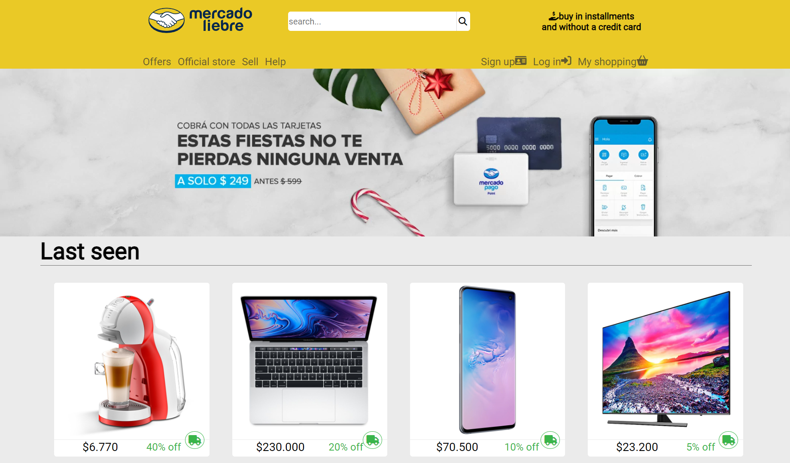

<h1 align="center"><b>Hi , I'm Miguel Angel </b></h1>

<!-- 

 

 -->

## <b> About me</b>

  

  

    🔵I enjoy challenges and continuous learning. 
    🔵I am very organized and structured. 
    🔵I can easily adapt to a team that has started or is starting a project. 
    🔵I am capable of learning new tools and methodologies in a short time. 
    🔵I like to create and innovate. 
    🔵I want to learn new technologies and specialize in the ones I already know. 
  

---

## **My Projects**

<table>
	<tr>
		<td width="50%">
				<h3 align="center">Mercado Liebre</h3>
				 
				

					
					   
					   

Esta es una copia del famoso E-comerce Mercado Libre, es una copia estatica creada paara la academia <a href="" target="_blank">Digital House</a>
 
 

					

				

		</td>
	</tr>
	
<table>
 
---

## <b> Skills</b>

  

  

  

  

---

 

## <b> Github Stats </b>

 

 
 

 

